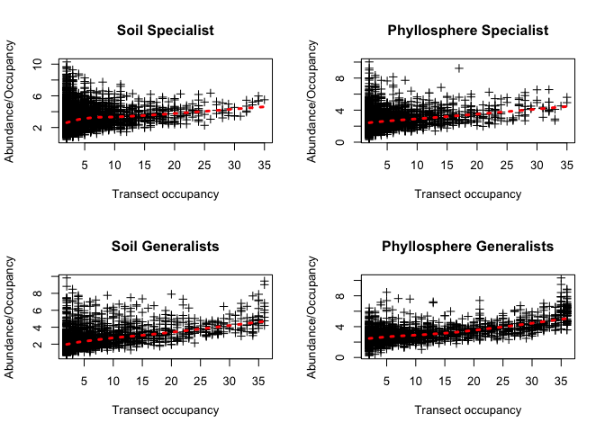
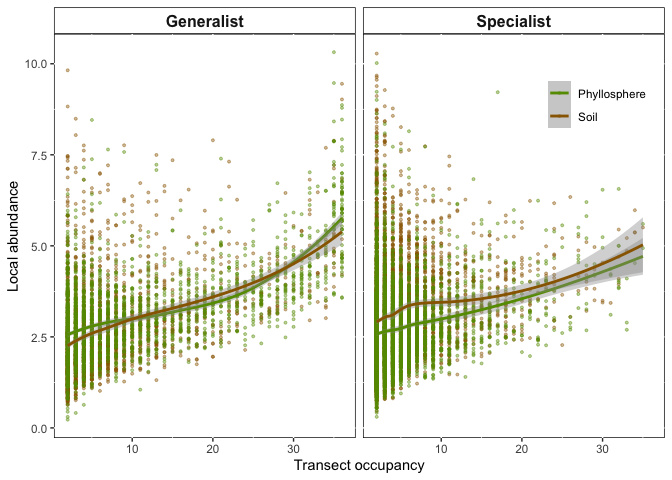

Untitled
================

``` r
library(ggplot2)
```

Check to see if there is a directory that can hold all the generated results. If not, make one

``` r
dir.create(file.path("./", "Generated.Results"), showWarnings = FALSE)
```

Set the minimum number of occurences an OTU must appear in a transect

This is not so important within this rmd code, but it was really important while setting up the project. See "./Users/fungi2/Google Drive/Projects/Vanuatu/Vanuatu Molecular/New\_Analysis/R/Mapping.Single.Species.Figure3.lm-pres\_occ.R""

``` r
BBB=2
```

``` r
#setwd("/Users/fungi2/Google Drive/Projects/Vanuatu/Vanuatu Molecular/New_Analysis/R")


# Load up the required CSV
BBB=2
gr.spec <- read.csv(file = paste("/Users/fungi/Google Drive/Projects/Vanuatu/Vanuatu Molecular/New_Analysis/R/Mapping.single.sp/Mantel.0.05/Patch.occupancy/special.grnd.",BBB,".occur.results.csv"), header = TRUE)
un.spec <- read.csv(file = paste("/Users/fungi/Google Drive/Projects/Vanuatu/Vanuatu Molecular/New_Analysis/R/Mapping.single.sp/Mantel.0.05/Patch.occupancy/special.undr.",BBB,".occur.results.csv"), header = TRUE)
ungr.gen <- read.csv(file = paste("/Users/fungi/Google Drive/Projects/Vanuatu/Vanuatu Molecular/New_Analysis/R/Mapping.single.sp/Mantel.0.05/Patch.occupancy/gen.grnd.undr.",BBB,".occur.results.csv"), header = TRUE)

par(mfrow=c(2,2))
scatter.smooth(x=gr.spec$Ground.PA, y=gr.spec$Ground.abund/gr.spec$Ground.PA, 
               main="Soil Specialist", 
               xlab="Transect occupancy", ylab="Abundance/Occupancy",
               lpars = list(col = "red", lwd = 3, lty = 3), pch = 3) 
linearMod <- lm(Ground.abund/gr.spec$Ground.PA ~ Ground.PA, data=gr.spec)  # build linear regression model on full data
summary(linearMod)
```

    ## 
    ## Call:
    ## lm(formula = Ground.abund/gr.spec$Ground.PA ~ Ground.PA, data = gr.spec)
    ## 
    ## Residuals:
    ##     Min      1Q  Median      3Q     Max 
    ## -2.5265 -0.9873 -0.2309  0.7276  7.2953 
    ## 
    ## Coefficients:
    ##             Estimate Std. Error t value Pr(>|t|)    
    ## (Intercept) 2.879144   0.031295   92.00   <2e-16 ***
    ## Ground.PA   0.053023   0.004707   11.27   <2e-16 ***
    ## ---
    ## Signif. codes:  0 '***' 0.001 '**' 0.01 '*' 0.05 '.' 0.1 ' ' 1
    ## 
    ## Residual standard error: 1.362 on 4109 degrees of freedom
    ## Multiple R-squared:  0.02996,    Adjusted R-squared:  0.02972 
    ## F-statistic: 126.9 on 1 and 4109 DF,  p-value: < 2.2e-16

``` r
scatter.smooth(x=un.spec$Under.PA, y=un.spec$Under.abund/un.spec$Under.PA, 
               main="Phyllosphere Specialist", 
               xlab="Transect occupancy", ylab="Abundance/Occupancy",
               lpars = list(col = "red", lwd = 3, lty = 3), pch = 3) 
```

    ## Warning in simpleLoess(y, x, w, span, degree = degree, parametric = FALSE, :
    ## pseudoinverse used at 3

    ## Warning in simpleLoess(y, x, w, span, degree = degree, parametric = FALSE, :
    ## neighborhood radius 1

    ## Warning in simpleLoess(y, x, w, span, degree = degree, parametric = FALSE, :
    ## reciprocal condition number -0

    ## Warning in simpleLoess(y, x, w, span, degree = degree, parametric = FALSE, :
    ## pseudoinverse used at 3

    ## Warning in simpleLoess(y, x, w, span, degree = degree, parametric = FALSE, :
    ## neighborhood radius 1

    ## Warning in simpleLoess(y, x, w, span, degree = degree, parametric = FALSE, :
    ## reciprocal condition number -0

    ## Warning in simpleLoess(y, x, w, span, degree = degree, parametric = FALSE, :
    ## pseudoinverse used at 3

    ## Warning in simpleLoess(y, x, w, span, degree = degree, parametric = FALSE, :
    ## neighborhood radius 1

    ## Warning in simpleLoess(y, x, w, span, degree = degree, parametric = FALSE, :
    ## reciprocal condition number -0

    ## Warning in simpleLoess(y, x, w, span, degree = degree, parametric = FALSE, :
    ## pseudoinverse used at 3

    ## Warning in simpleLoess(y, x, w, span, degree = degree, parametric = FALSE, :
    ## neighborhood radius 1

    ## Warning in simpleLoess(y, x, w, span, degree = degree, parametric = FALSE, :
    ## reciprocal condition number -0

    ## Warning in simpleLoess(y, x, w, span, degree = degree, parametric = FALSE, :
    ## pseudoinverse used at 3

    ## Warning in simpleLoess(y, x, w, span, degree = degree, parametric = FALSE, :
    ## neighborhood radius 1

    ## Warning in simpleLoess(y, x, w, span, degree = degree, parametric = FALSE, :
    ## reciprocal condition number -0

``` r
linearMod <- lm(Under.abund ~ Under.PA, data=un.spec)  # build linear regression model on full data
summary(linearMod)
```

    ## 
    ## Call:
    ## lm(formula = Under.abund ~ Under.PA, data = un.spec)
    ## 
    ## Residuals:
    ##     Min      1Q  Median      3Q     Max 
    ## -34.155  -2.117   0.123   2.188  96.256 
    ## 
    ## Coefficients:
    ##             Estimate Std. Error t value Pr(>|t|)    
    ## (Intercept) -3.72915    0.13977  -26.68   <2e-16 ***
    ## Under.PA     3.77612    0.02213  170.60   <2e-16 ***
    ## ---
    ## Signif. codes:  0 '***' 0.001 '**' 0.01 '*' 0.05 '.' 0.1 ' ' 1
    ## 
    ## Residual standard error: 6.713 on 4784 degrees of freedom
    ## Multiple R-squared:  0.8588, Adjusted R-squared:  0.8588 
    ## F-statistic: 2.911e+04 on 1 and 4784 DF,  p-value: < 2.2e-16

``` r
scatter.smooth(x=ungr.gen$Ground.PA, y=ungr.gen$Ground.abund/ungr.gen$Ground.PA, 
               main="Soil Generalists", 
               xlab="Transect occupancy", ylab="Abundance/Occupancy",
               lpars = list(col = "red", lwd = 3, lty = 3), pch = 3) 
linearMod <- lm(Ground.abund ~ Ground.PA, data=ungr.gen)  # build linear regression model on full data
summary(linearMod)
```

    ## 
    ## Call:
    ## lm(formula = Ground.abund ~ Ground.PA, data = ungr.gen)
    ## 
    ## Residuals:
    ##     Min      1Q  Median      3Q     Max 
    ## -46.275  -5.334   0.981   3.949 189.538 
    ## 
    ## Coefficients:
    ##             Estimate Std. Error t value Pr(>|t|)    
    ## (Intercept) -8.42135    0.41001  -20.54   <2e-16 ***
    ## Ground.PA    4.41978    0.03927  112.55   <2e-16 ***
    ## ---
    ## Signif. codes:  0 '***' 0.001 '**' 0.01 '*' 0.05 '.' 0.1 ' ' 1
    ## 
    ## Residual standard error: 13.79 on 2278 degrees of freedom
    ## Multiple R-squared:  0.8476, Adjusted R-squared:  0.8475 
    ## F-statistic: 1.267e+04 on 1 and 2278 DF,  p-value: < 2.2e-16

``` r
scatter.smooth(x=ungr.gen$Under.PA, y=ungr.gen$Under.abund/ungr.gen$Under.PA,
               main="Phyllosphere Generalists", 
               xlab="Transect occupancy", ylab="Abundance/Occupancy",
               lpars = list(col = "red", lwd = 3, lty = 3), pch = 3) 
```



``` r
linearMod <- lm(Ground.abund ~ Ground.PA, data=ungr.gen)  # build linear regression model on full data
summary(linearMod)
```

    ## 
    ## Call:
    ## lm(formula = Ground.abund ~ Ground.PA, data = ungr.gen)
    ## 
    ## Residuals:
    ##     Min      1Q  Median      3Q     Max 
    ## -46.275  -5.334   0.981   3.949 189.538 
    ## 
    ## Coefficients:
    ##             Estimate Std. Error t value Pr(>|t|)    
    ## (Intercept) -8.42135    0.41001  -20.54   <2e-16 ***
    ## Ground.PA    4.41978    0.03927  112.55   <2e-16 ***
    ## ---
    ## Signif. codes:  0 '***' 0.001 '**' 0.01 '*' 0.05 '.' 0.1 ' ' 1
    ## 
    ## Residual standard error: 13.79 on 2278 degrees of freedom
    ## Multiple R-squared:  0.8476, Adjusted R-squared:  0.8475 
    ## F-statistic: 1.267e+04 on 1 and 2278 DF,  p-value: < 2.2e-16

``` r
dev.off()
```

    ## null device 
    ##           1

``` r
####################################################################
gr.spec2 <- gr.spec[,1:3]
gr.spec2$ID <- "Soil.Specialist"
gr.spec2$Habitat <- "Soil"
gr.spec2$Lifestyle <- "Specialist"
names(gr.spec2) <- c("OTU","Abundance","Occupancy","ID","Habitat","lifestyle")

un.spec2 <- un.spec[,c(1,4:5)]
un.spec2$ID <- "Phyllo.Specialist"
un.spec2$Habitat <- "Phyllosphere"
un.spec2$Lifestyle <- "Specialist"
names(un.spec2) <- c("OTU","Abundance","Occupancy","ID","Habitat","lifestyle")

#ungr.gen 
gr.gen <- ungr.gen[,1:3]
gr.gen$ID <- "Soil.Generalist"
gr.gen$Habitat <- "Soil"
gr.gen$Lifestyle <- "Generalist"
names(gr.gen) <-  c("OTU","Abundance","Occupancy","ID","Habitat","lifestyle")

un.gen <- ungr.gen[,c(1,4:5)]
un.gen$ID <- "Phyllo.Generalist"
un.gen$Habitat <- "Phyllosphere"
un.gen$Lifestyle <- "Generalist"
names(un.gen) <-  c("OTU","Abundance","Occupancy","ID","Habitat","lifestyle")


full.table <- rbind(gr.spec2,un.spec2,gr.gen,un.gen)
full.table$Avg.Abund <- full.table$Abundance/full.table$Occupancy


#Set colour palette
ground.und.colours <- c( "#669900","#996600")

names(full.table)
```

    ## [1] "OTU"       "Abundance" "Occupancy" "ID"        "Habitat"   "lifestyle"
    ## [7] "Avg.Abund"

``` r
ggplot(data=full.table, aes(x=Occupancy, y=Avg.Abund, col=Habitat))+
  geom_point(alpha = 4/10, size = 0.7)+
  scale_colour_manual(values=ground.und.colours)+
  stat_smooth(method='loess')+
  facet_grid(.~lifestyle)+
  #scale_color_viridis() +
  #labs(title = "Interspecific Occupancy–abundance relationship") +
  xlab(paste("Transect occupancy"))+ # \n (number of occurences / transect)")) +
  ylab(paste("Local abundance"))+ # \n (OTU sequence reads/number of occurences)")) +
    theme(panel.background = element_rect(fill = "white", colour = "black"),
        strip.background = element_rect(fill = "white", colour = "black"),
        #legend.key = element_blank(),
        legend.justification = c(1.1, 0),# x-axis 
        legend.position = c(1, 0.75),# y-axis
        legend.title = element_blank(),
        strip.text.x = element_text(size=12, face="bold"))
```

    ## `geom_smooth()` using formula 'y ~ x'



And save it

``` r
ggsave( plot = last_plot(), filename = paste("./Generated.Results/Occupancy_abundance.MinTransectOccur",BBB,".pdf"), device = NULL, path = NULL,
        scale = 1, width = 180, height = 100, units = "mm", 
        dpi = 300, limitsize = TRUE)
```

    ## `geom_smooth()` using formula 'y ~ x'
