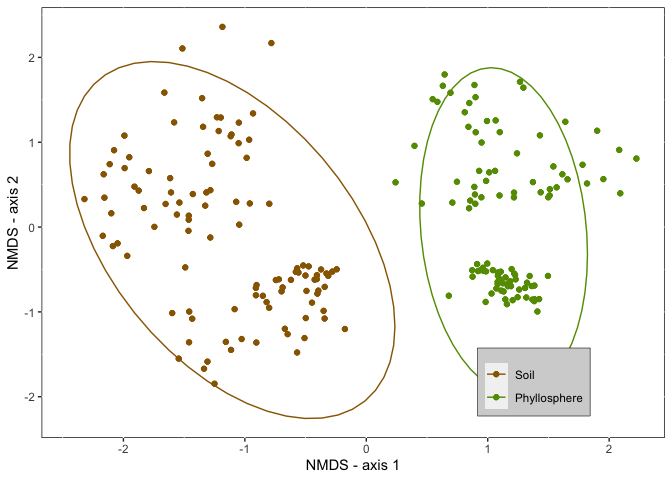

Untitled
================

Take care of some housekeeping

``` r
# following this site
rm(list=ls())
dir.create(file.path("./", "Generated.Results"), showWarnings = FALSE)
```

Install some packages:

``` r
library("phyloseq")
library("vegan")
```

    ## Loading required package: permute

    ## Loading required package: lattice

    ## This is vegan 2.5-6

``` r
library("ggplot2")
#library("tidyr")
library("dplyr")
```

    ## 
    ## Attaching package: 'dplyr'

    ## The following objects are masked from 'package:stats':
    ## 
    ##     filter, lag

    ## The following objects are masked from 'package:base':
    ## 
    ##     intersect, setdiff, setequal, union

``` r
#library("automap")
#library("mltools")
```

The working directory is set within this RMD package, But we're still going to need some data to work with For now this is stored on a local repository In the future link this to a figshare DOI

``` r
#set WD
setwd("/Users/fungi/Google Drive/Projects/Vanuatu/Vanuatu Molecular/New_Analysis/R")

# load data
# a transformed phyloseq object 
vst_physeq <- readRDS(file = "vst_physeq_geog.rds")
```

Remove OTUs that do not show appear more than 0 times in more than half the samples

``` r
sbst <- subset_samples(vst_physeq, Sample_Type == c("Understory","Ground"))
    count_tab <-  otu_table(sbst) #this is an OTU table with abundences for the OTUs subsetted above 
    count_tab[count_tab <= 0.0] <- 0.0 # since this is a VST transeformed dataset, we'll need to set negative values to zero

    count_tab <- count_tab[rowSums(count_tab)>1,]
    
     otu_table(sbst) <- count_tab # and reinsert into the phylloseq object 
 sample_sums(sbst)[1:10] # double check to make sure tha worked 
```

    ##     011G2     011G4     011G6     011G8     011N3     011N5     011N7     011N9 
    ## 1035.3321 1139.2643  873.7539  571.3295  909.4103  888.6697  751.0042  678.7870 
    ##     012G2     012G4 
    ##  718.3669  968.5651

A quick name shuffle to make IDs more meaningfull

``` r
change_id <-  sample_data(sbst)
levels(change_id$Sample_Type)[match("Ground",levels(change_id$Sample_Type))] <- "Soil"
levels(change_id$Sample_Type)[match("Understory",levels(change_id$Sample_Type))] <- "Phyllosphere"
sample_data(sbst) <- change_id
```

``` r
GP.ord <- ordinate(sbst, "NMDS", "bray")
```

    ## Wisconsin double standardization
    ## Run 0 stress 0.1630175 
    ## Run 1 stress 0.1683439 
    ## Run 2 stress 0.1631163 
    ## ... Procrustes: rmse 0.006795609  max resid 0.05869388 
    ## Run 3 stress 0.1682757 
    ## Run 4 stress 0.1632379 
    ## ... Procrustes: rmse 0.004150453  max resid 0.03575069 
    ## Run 5 stress 0.168419 
    ## Run 6 stress 0.1629849 
    ## ... New best solution
    ## ... Procrustes: rmse 0.008752851  max resid 0.05899812 
    ## Run 7 stress 0.1682498 
    ## Run 8 stress 0.1631162 
    ## ... Procrustes: rmse 0.004240728  max resid 0.0575423 
    ## Run 9 stress 0.1635126 
    ## Run 10 stress 0.1704569 
    ## Run 11 stress 0.1633595 
    ## ... Procrustes: rmse 0.006455099  max resid 0.05843473 
    ## Run 12 stress 0.1753768 
    ## Run 13 stress 0.1630871 
    ## ... Procrustes: rmse 0.01061153  max resid 0.08636451 
    ## Run 14 stress 0.1886321 
    ## Run 15 stress 0.168606 
    ## Run 16 stress 0.1629846 
    ## ... New best solution
    ## ... Procrustes: rmse 7.034578e-05  max resid 0.0006315111 
    ## ... Similar to previous best
    ## Run 17 stress 0.1633849 
    ## ... Procrustes: rmse 0.004090581  max resid 0.05624394 
    ## Run 18 stress 0.168558 
    ## Run 19 stress 0.162985 
    ## ... Procrustes: rmse 0.000109156  max resid 0.00124457 
    ## ... Similar to previous best
    ## Run 20 stress 0.1629846 
    ## ... New best solution
    ## ... Procrustes: rmse 5.120622e-06  max resid 4.661672e-05 
    ## ... Similar to previous best
    ## *** Solution reached

Only if you're interested in plotting by transect also

``` r
class(sample_data(sbst)$Transect)
```

    ## [1] "numeric"

``` r
sample_data(sbst)$Transect <- as(sample_data(sbst)$Transect, "character")
```

``` r
#Set colour palette
ground.und.colours <- c("#996600","#669900")
# change labels to more appropriate names 


p2 = plot_ordination(sbst, GP.ord,color="Sample_Type")#, shape = "Transect")
p2 + 
  #geom_polygon(aes(fill=Sample_Type)) + 
  geom_point() + 
  scale_colour_manual(values=ground.und.colours)+
  stat_ellipse() +
  xlab("NMDS - axis 1")+
  ylab("NMDS - axis 2")+
  theme(panel.background = element_rect(fill = "white", colour = "black"),
        strip.background = element_rect(fill = "white", colour = "black"),
        #legend.key = element_blank(),
        #legend.justification = c(1.1, 0),# x-axis 
        legend.position = c(0.79, 0.13),# x,y
        legend.title = element_blank(),
        legend.background = element_rect(fill = "lightgrey",
                                  size=0.2, linetype="solid",
                                  colour ="black"))
```



``` r
 #labs(title = "NMDS Plot")
```

Time for a PermANOVA (adonis)

``` r
sbst_bray <- phyloseq::distance(sbst, method = "bray")
sampledf <- data.frame(sample_data(sbst))
adonis(sbst_bray ~ Sample_Type, data = sampledf)
```

    ## 
    ## Call:
    ## adonis(formula = sbst_bray ~ Sample_Type, data = sampledf) 
    ## 
    ## Permutation: free
    ## Number of permutations: 999
    ## 
    ## Terms added sequentially (first to last)
    ## 
    ##              Df SumsOfSqs MeanSqs F.Model      R2 Pr(>F)    
    ## Sample_Type   1     9.035  9.0352  24.621 0.10539  0.001 ***
    ## Residuals   209    76.697  0.3670         0.89461           
    ## Total       210    85.732                 1.00000           
    ## ---
    ## Signif. codes:  0 '***' 0.001 '**' 0.01 '*' 0.05 '.' 0.1 ' ' 1

And save it

``` r
ggsave( plot = last_plot(), filename = paste("./Generated.Results/NMDS_SoilPhyllosphere.pdf"), device = NULL, path = NULL,
        scale = 1, width = 88, height = 88, units = "mm", 
        dpi = 300, limitsize = TRUE)
```
