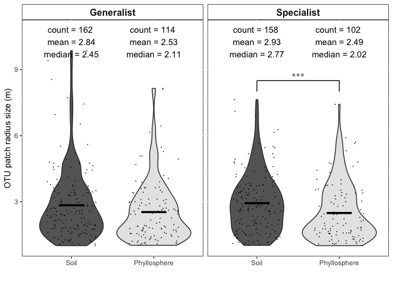

Untitled
================

Here is a function used for this scripts

``` r
stat_box_data <- function(y, upper_limit = max(un.gr.gen$Range) * 1.15) {
  return( 
    data.frame(
      y = 0.95 * upper_limit,
      label = paste('count =', length(y), '\n',
                    'mean =', round(mean(y), 2), '\n',
                    'median =', round(median(y), 2), '\n')
    )
  )
}
```

heres some library packages that may be handy

``` r
library(sp)
library(gstat)
library(reshape2)
library(viridis)
```

    ## Loading required package: viridisLite

``` r
library(automap)
suppressPackageStartupMessages({
  library(dplyr) # for "glimpse"
  library(ggplot2)
  library(scales) # for "comma"
  library(magrittr)
})
```

Parameters
==========

These parameters are going to to control outliers and garbage variograms \#Outliers Some of the estimated ranges are really big!! For example most OTU range sizes are in around 3 meters Several ranges are extimated at several kilometers. Their variograms seem robust, but their really throwing the entire analysis \#garbage variograms a lot of auto-generated variograms were bad models It turns out most of these bad models were estimating really small ranges (&lt;1 m). Since our minimum sampling distance was 3.3 m, it's hard to imagine a model infering smaller distances than what we sampled

So we'll remove: really big \[CCC\] and reallu small \[DDD\] models. CCC and DDD are in meters

``` r
CCC=10#meters
DDD=1#meter 
```

The data used in this first loop was generated in code titled:
--------------------------------------------------------------

/Users/fungi/Google Drive/Projects/Vanuatu/Vanuatu Molecular/New\_Analysis/R/Mapping.Single.Species.KriegLoop That code generate a zillion maps and csv files for various iterations of "minimum occurence" of an otu/transect

For the manuscript we landed on a min occurance of 2 (QQQ = 2)

This first loop perfomes wilcox test comparing the differnce in range size between specialists among Soil:Phyllosphere

The generated table reads as follows:

Transect\_\_\_ p-value 2.000000 0.003948 3.00000 0.01409 4.00000 0.02414 5.00000 0.05269 6.00000 0.07298

``` r
# Specialists #
for (BBB in 2:24) {
  take.a.look <- read.csv(file = paste("/Users/fungi/Google Drive/Projects/Vanuatu/Vanuatu Molecular/New_Analysis/R/Mapping.single.sp/Mantel.0.05/Maps/",BBB,"otu.range.habitat.csv"), header = TRUE)
  take.a.look <- take.a.look[complete.cases(take.a.look), ] # remove the NA's
  take.a.look <- take.a.look[take.a.look$Range>DDD,] # remove garbage variograms (you can also take a look at the maps in the corresponding directory)
  take.a.look <- take.a.look[take.a.look$Range<CCC,] # some ranges are really big
  print(c(BBB,wilcox.test(Range ~ Habitat, data = take.a.look, exact = FALSE)$p.value))
}
```

    ## [1] 2.000000000 0.002203062
    ## [1] 3.0000000 0.0116213
    ## [1] 4.00000000 0.04759084
    ## [1] 5.00000000 0.09826978
    ## [1] 6.0000000 0.1456171
    ## [1] 7.000000 0.285181
    ## [1] 8.0000000 0.1888192
    ## [1] 9.0000000 0.1261945
    ## [1] 10.00000000  0.02462342
    ## [1] 11.00000000  0.06355185
    ## [1] 12.000000  0.292952
    ## [1] 13.0000000  0.3938824
    ## [1] 14.0000000  0.3631777
    ## [1] 15.0000000  0.3266988
    ## [1] 16.0000000  0.4126759
    ## [1] 17.0000000  0.5100192
    ## [1] 18.0000000  0.2766049
    ## [1] 19.0000000  0.3619348
    ## [1] 20.00000000  0.07504923
    ## [1] 21.0000000  0.1643293
    ## [1] 22.0000000  0.1643293
    ## [1] 23.0000000  0.2193026
    ## [1] 24.0000000  0.6170751

We decide that we would like to investigate the minimum occurance of QQQ(or BBB) = 2

This will give us a nicer table of differences between the two habitas

``` r
BBB=2 #min occur
take.a.look <- read.csv(file = paste("/Users/fungi/Google Drive/Projects/Vanuatu/Vanuatu Molecular/New_Analysis/R/Mapping.single.sp/Mantel.0.05/Maps/",BBB,"otu.range.habitat.csv"), header = TRUE)
take.a.look <- take.a.look[complete.cases(take.a.look), ] # remove the NA's
take.a.look <- take.a.look[take.a.look$Range>DDD,] # remove garbage variograms (you can also take a look at the maps in the corresponding directory)
take.a.look <- take.a.look[take.a.look$Range<CCC,] # there are three OTU with large ranges - This is what they look like -> take.a.look[take.a.look$Range>30,]
spec <- take.a.look
# this is the table you will want to use for publication 
#take.a.look # OTU / Range / Habitat / Max.abun / Species
take.a.look %>%
  group_by(Habitat) %>%
  summarise(
    median = median(Range),
    mean =mean(Range),
    sd = sd(Range),
    n = n(),
    min.range = min(Range),
    max.range = max(Range)
  )
```

    ## # A tibble: 2 x 7
    ##   Habitat    median  mean    sd     n min.range max.range
    ##   <fct>       <dbl> <dbl> <dbl> <int>     <dbl>     <dbl>
    ## 1 Ground       2.77  2.93  1.32   158      1.02      7.63
    ## 2 Understory   2.02  2.49  1.30   102      1.01      7.42

``` r
wilcox.test(Range ~ Habitat, data = take.a.look, exact = FALSE)$p.value
```

    ## [1] 0.002203062

Now run the same two loops (as above) but for \#Generalists

Which min occurence number is significantly different between Generalists among Soil:Phyllosphere

``` r
# Generalists #
for (BBB in 2:30) { # which occupancy has significant p-values 
  take.a.look <- read.csv(file = paste("/Users/fungi/Google Drive/Projects/Vanuatu/Vanuatu Molecular/New_Analysis/R/Mapping.single.sp/Mantel.0.05/Maps/",BBB,"otu.range.habitat.generalist.csv"), header = TRUE)
  take.a.look <- take.a.look[take.a.look$Range>DDD,] # remove garbage variograms (you can also take a look at the maps in the corresponding directory)
  take.a.look <- take.a.look[take.a.look$Range<CCC,]
  print(c(BBB,wilcox.test(Range ~ Habitat, data = take.a.look, exact = FALSE)$p.value))
}
```

    ## [1] 2.00000000 0.06158134
    ## [1] 3.000000 0.813479
    ## [1] 4.0000000 0.9217702
    ## [1] 5.000000 0.792767
    ## [1] 6.0000000 0.3676277
    ## [1] 7.0000000 0.6056182
    ## [1] 8.0000000 0.8137878
    ## [1] 9.0000000 0.4421956
    ## [1] 10.0000000  0.2523218
    ## [1] 11.0000000  0.4605883
    ## [1] 12.00000  0.30301
    ## [1] 13.0000000  0.4586677
    ## [1] 14.0000000  0.2771017
    ## [1] 15.0000000  0.9842314
    ## [1] 16.0000000  0.9586084
    ## [1] 17.0000000  0.8054098
    ## [1] 18  1
    ## [1] 19.0000000  0.4137745
    ## [1] 20.0000000  0.2771251
    ## [1] 21.0000000  0.3971011
    ## [1] 22.0000000  0.4519135
    ## [1] 23.0000000  0.4519135
    ## [1] 24.0000000  0.4432885
    ## [1] 25.0000000  0.5203168
    ## [1] 26.0000000  0.8325188
    ## [1] 27.0000000  0.9567498
    ## [1] 28.0000000  0.9567498
    ## [1] 29.000000  0.714393
    ## [1] 30.000000  0.714393

``` r
BBB=2 #min occur
take.a.look <- read.csv(file = paste("/Users/fungi/Google Drive/Projects/Vanuatu/Vanuatu Molecular/New_Analysis/R/Mapping.single.sp/Mantel.0.05/Maps/",BBB,"otu.range.habitat.generalist.csv"), header = TRUE)
take.a.look <- take.a.look[complete.cases(take.a.look), ] # remove the NA's
take.a.look <- take.a.look[take.a.look$Range>DDD,] # remove garbage variograms (you can also take a look at the maps in the corresponding directory)
take.a.look <- take.a.look[take.a.look$Range<CCC,]# there are three OTU with large ranges - This is what they look like -> take.a.look[take.a.look$Range>30,]
genr <- take.a.look
#take.a.look # OTU / Range / Habitat / Max.abun / Species
take.a.look %>%
  group_by(Habitat) %>%
  summarise(
    median = median(Range),
    mean =mean(Range),
    sd = sd(Range),
    n = n(),
    min.range = min(Range),
    max.range = max(Range)
  )
```

    ## # A tibble: 2 x 7
    ##   Habitat    median  mean    sd     n min.range max.range
    ##   <fct>       <dbl> <dbl> <dbl> <int>     <dbl>     <dbl>
    ## 1 Ground       2.45  2.84  1.57   162      1.00      9.86
    ## 2 Understory   2.11  2.53  1.39   114      1.02      8.14

``` r
wilcox.test(Range ~ Habitat, data = take.a.look, exact = FALSE)$p.value
```

    ## [1] 0.06158134

``` r
# now you have two datasets that are either specialists or generalists
spec$SG <- "Specialist"
genr$SG <- "Generalist"
# add a id tag and combine 
un.gr.gen <- rbind(spec,genr)


un.gr.gen %>%
  group_by(SG) %>%
  summarise(
    median = median(Range),
    mean =mean(Range),
    sd = sd(Range),
    n = n(),
    min.range = min(Range),
    max.range = max(Range)
  )
```

    ## # A tibble: 2 x 7
    ##   SG         median  mean    sd     n min.range max.range
    ##   <chr>       <dbl> <dbl> <dbl> <int>     <dbl>     <dbl>
    ## 1 Generalist   2.42  2.71  1.51   276      1.00      9.86
    ## 2 Specialist   2.58  2.76  1.33   260      1.01      7.63

``` r
# check for normality 
shapiro.test(spec$Range)
```

    ## 
    ##  Shapiro-Wilk normality test
    ## 
    ## data:  spec$Range
    ## W = 0.92367, p-value = 2.715e-10

``` r
shapiro.test(genr$Range)
```

    ## 
    ##  Shapiro-Wilk normality test
    ## 
    ## data:  genr$Range
    ## W = 0.84335, p-value = 4.939e-16

``` r
# For the both datasets p < 0.05 suggesting strong evidence of non-normality and a nonparametric test should be used


wilcox.test(Range ~ Habitat, data = spec, exact = FALSE)$p.value
```

    ## [1] 0.002203062

``` r
wilcox.test(Range ~ Habitat, data = genr, exact = FALSE)$p.value
```

    ## [1] 0.06158134

``` r
wilcox.test(Range ~ Habitat, data = un.gr.gen, exact = FALSE)$p.value
```

    ## [1] 0.0003517138

``` r
un.gr.gen$group <- paste(un.gr.gen$Habitat,un.gr.gen$SG)
pairwise.wilcox.test(un.gr.gen$Range,un.gr.gen$group,p.adjust.method = "BH")
```

    ## 
    ##  Pairwise comparisons using Wilcoxon rank sum test 
    ## 
    ## data:  un.gr.gen$Range and un.gr.gen$group 
    ## 
    ##                       Ground Generalist Ground Specialist Understory Generalist
    ## Ground Specialist     0.1832            -                 -                    
    ## Understory Generalist 0.0924            0.0066            -                    
    ## Understory Specialist 0.0843            0.0066            0.8675               
    ## 
    ## P value adjustment method: BH

Make a plot

``` r
# set the order you'd like
un.gr.gen$group <- factor(un.gr.gen$group , levels=c("Understory Specialist", "Ground Specialist", "Understory Generalist", "Ground Generalist"))
# annotation
anno <- data.frame(x1 = 1, x2 = 2, y1 = 8, y2 = 8.5, xstar = 1.5, ystar = 8.7, lab = "***", SG = "Specialist")
# change labels to more appropriate names 
levels(un.gr.gen$Habitat)[match("Understory",levels(un.gr.gen$Habitat))] <- "Phyllosphere"
levels(un.gr.gen$Habitat)[match("Ground",levels(un.gr.gen$Habitat))] <- "Soil"


ggplot(un.gr.gen, aes(x = Habitat, y = Range, fill=Habitat)) +
  geom_violin() + 
  stat_summary(fun.data = stat_box_data, 
               geom = "text", 
               hjust = 0.5,
               vjust = 0.9) +
  stat_summary(fun.y = mean, 
               fun.ymin = mean, 
               fun.ymax = mean, 
               geom = "crossbar", 
               width = 0.3)+
  geom_jitter(shape=16, size=.3, position=position_jitter(0.3))+
  scale_x_discrete(name = "") + 
  scale_y_continuous(name = "OTU patch radius size (m)") +
  scale_fill_grey(start = 0.4, end = 0.9) +
  facet_grid(. ~ SG) +
  geom_text(data = anno, aes(x = xstar,  y = ystar, label = lab,fill=NULL),family = "Times") +
  geom_segment(data = anno, aes(x = x1, xend = x1, 
                                y = y1, yend = y2,fill=NULL),
               colour = "black") +
  geom_segment(data = anno, aes(x = x2, xend = x2, 
                                y = y1, yend = y2,fill=NULL),
               colour = "black") +
  geom_segment(data = anno, aes(x = x1, xend = x2, 
                                y = y2, yend = y2,fill=NULL),
               colour = "black")+
  theme(panel.background = element_rect(fill = "white", colour = "black"),
        strip.background = element_rect(fill = "white", colour = "black"),
        legend.key = element_blank(),
        legend.position = "none",
        legend.title = element_blank(),
        strip.text.x = element_text(size=12, face="bold"))
```

    ## Warning: `fun.y` is deprecated. Use `fun` instead.

    ## Warning: `fun.ymin` is deprecated. Use `fun.min` instead.

    ## Warning: `fun.ymax` is deprecated. Use `fun.max` instead.

 Save the plot

``` r
ggsave("OTU range size.pdf", plot = last_plot(), device = NULL, path = NULL,
       scale = 1, width = 14, height = 8, units = "in", 
       dpi = 150, limitsize = TRUE)
```

Note that the `echo = FALSE` parameter was added to the code chunk to prevent printing of the R code that generated the plot.
