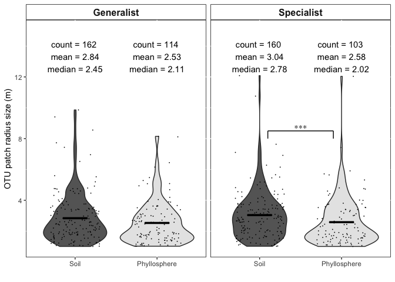

Untitled
================

Here is a function used for this scripts It makes a little bracket for the violin plots at the end of the script.

``` r
stat_box_data <- function(y, upper_limit = max(un.gr.gen$Range) * 1.15) {
  return( 
    data.frame(
      y = 0.95 * upper_limit,
      label = paste('count =', length(y), '\n',
                    'mean =', round(mean(y), 2),'\n',
                    'median =', round(median(y), 2), '\n')#,
                    #'sd =', round(sd(y), 2), '\n',)
    )
  )
}
```

heres some library packages that may be handy

``` r
library(sp)
library(gstat)
library(reshape2)
library(viridis)
```

    ## Loading required package: viridisLite

``` r
library(automap)
suppressPackageStartupMessages({
  library(dplyr) # for "glimpse"
  library(ggplot2)
  library(scales) # for "comma"
  library(magrittr)
})
```

Check to see if there is a directory that can hold all the generated results. If not, make one

``` r
dir.create(file.path("./", "Generated.Results"), showWarnings = FALSE)
```

Parameters
==========

These parameters are going to to control outliers and garbage variograms \#Outliers Some of the estimated ranges are really big!! For example most OTU range sizes are in around 3 meters Several ranges are extimated at several kilometers. Their variograms seem robust, but their really throwing the analysis and figures \#garbage variograms a lot of auto-generated variograms were bad models It turns out most of these bad models were estimating really small ranges (&lt;1 m). Since our minimum sampling distance was 3.3 m, it's hard to imagine a model infering smaller distances than what we sampled

So we'll remove: really big \[CCC\] and reallu small \[DDD\] models. CCC and DDD are in meters

``` r
CCC=13#meters
DDD=1#meter 
```

The data used in this first loop was generated in code titled:
--------------------------------------------------------------

/Users/fungi/Google Drive/Projects/Vanuatu/Vanuatu Molecular/New\_Analysis/R/Mapping.Single.Species.KriegLoop That code generate a zillion maps and csv files for various iterations of "minimum occurence" of an otu/transect

For the manuscript we landed on a min occurance of 2 (QQQ = 2)

This first loop perfomes wilcox test comparing the differnce in range size between specialists among Soil:Phyllosphere

The generated table reads as follows:

Transect\_\_\_ p-value

``` r
# Specialists #
for (BBB in 2:24) {
  take.a.look <- read.csv(file = paste("/Users/fungi/Google Drive/Projects/Vanuatu/Vanuatu Molecular/New_Analysis/R/Mapping.single.sp/Mantel.0.05/Maps/",BBB,"otu.range.habitat.csv"), header = TRUE)
  take.a.look <- take.a.look[complete.cases(take.a.look), ] # remove the NA's
  #take.a.look <- take.a.look[take.a.look$Range>DDD,] # remove garbage variograms (you can also take a look at the maps in the corresponding directory)
  #take.a.look <- take.a.look[take.a.look$Range<CCC,] # some ranges are really big
  print(c(BBB,wilcox.test(Range ~ Habitat, data = take.a.look, exact = FALSE)$p.value))
}
```

    ## [1] 2.0000000 0.1717514
    ## [1] 3.0000000 0.1519116
    ## [1] 4.000000 0.282092
    ## [1] 5.000000 0.359129
    ## [1] 6.0000000 0.6736242
    ## [1] 7.0000000 0.9808416
    ## [1] 8.0000000 0.7103858
    ## [1] 9.0000000 0.4981654
    ## [1] 10.0000000  0.1830986
    ## [1] 11.0000000  0.4654608
    ## [1] 12.0000000  0.5266262
    ## [1] 13.0000000  0.5765028
    ## [1] 14.0000000  0.5306508
    ## [1] 15.000000  0.631187
    ## [1] 16.0000000  0.7931095
    ## [1] 17.0000000  0.9048887
    ## [1] 18.0000000  0.8342462
    ## [1] 19.000000  0.641694
    ## [1] 20.0000000  0.1697061
    ## [1] 21.0000000  0.2122691
    ## [1] 22.000000  0.302813
    ## [1] 23.0000000  0.4237108
    ## [1] 24.000000  0.897279

We decide that we would like to investigate the minimum occurance of QQQ(or BBB) = 2

This will give us a nicer table of differences between the two habitas

``` r
BBB=2 #min occur
take.a.look <- read.csv(file = paste("/Users/fungi/Google Drive/Projects/Vanuatu/Vanuatu Molecular/New_Analysis/R/Mapping.single.sp/Mantel.0.05/Maps/",BBB,"otu.range.habitat.csv"), header = TRUE)
take.a.look <- take.a.look[complete.cases(take.a.look), ] # remove the NA's
#take.a.look <- take.a.look[take.a.look$Range>DDD,] # remove garbage variograms (you can also take a look at the maps in the corresponding directory)
#take.a.look <- take.a.look[take.a.look$Range<CCC,] # there are three OTU with large ranges - This is what they look like -> take.a.look[take.a.look$Range>30,]
spec <- take.a.look
# this is the table you will want to use for publication 
#take.a.look # OTU / Range / Habitat / Max.abun / Species
take.a.look %>%
  group_by(Habitat) %>%
  summarise(
    median = median(Range),
    mean =mean(Range),
    sd = sd(Range),
    n = n(),
    min.range = min(Range),
    max.range = max(Range)
  )
```

    ## # A tibble: 2 x 7
    ##   Habitat    median  mean    sd     n min.range max.range
    ##   <fct>       <dbl> <dbl> <dbl> <int>     <dbl>     <dbl>
    ## 1 Ground      1.05   2.53  13.9   319   0.0262       248.
    ## 2 Understory  0.511 18.8  204.    232   0.00159     2880.

``` r
wilcox.test(Range ~ Habitat, data = take.a.look, exact = FALSE)$p.value
```

    ## [1] 0.1717514

Generalists
===========

Now run the same two loops (as above) but for generalists

Which min occurence number is significantly different between Generalists among Soil:Phyllosphere

``` r
# Generalists #
for (BBB in 2:30) { # which occupancy has significant p-values 
  take.a.look <- read.csv(file = paste("/Users/fungi/Google Drive/Projects/Vanuatu/Vanuatu Molecular/New_Analysis/R/Mapping.single.sp/Mantel.0.05/Maps/",BBB,"otu.range.habitat.generalist.csv"), header = TRUE)
#  take.a.look <- take.a.look[take.a.look$Range>DDD,] # remove garbage variograms (you can also take a look at the maps in the corresponding directory)
#  take.a.look <- take.a.look[take.a.look$Range<CCC,]
  print(c(BBB,wilcox.test(Range ~ Habitat, data = take.a.look, exact = FALSE)$p.value))
}
```

    ## [1] 2.00000000 0.04931643
    ## [1] 3.0000000 0.7948559
    ## [1] 4.0000000 0.2704734
    ## [1] 5.0000000 0.5572808
    ## [1] 6.0000000 0.8521136
    ## [1] 7.0000000 0.7438479
    ## [1] 8.0000000 0.6129871
    ## [1] 9.0000000 0.4834597
    ## [1] 10.0000000  0.5773657
    ## [1] 11.0000000  0.5757323
    ## [1] 12.000000  0.683575
    ## [1] 13.0000000  0.5601436
    ## [1] 14.0000000  0.6905279
    ## [1] 15.0000000  0.6480769
    ## [1] 16.0000000  0.4878779
    ## [1] 17.0000000  0.6272639
    ## [1] 18.0000000  0.2200741
    ## [1] 19.0000000  0.7381351
    ## [1] 20.0000000  0.7801848
    ## [1] 21.0000000  0.6985354
    ## [1] 22.0000000  0.4379428
    ## [1] 23.0000000  0.9616266
    ## [1] 24.0000000  0.7723374
    ## [1] 25.0000000  0.8983268
    ## [1] 26.0000000  0.9789763
    ## [1] 27.00000  0.93944
    ## [1] 28.00000  0.93944
    ## [1] 29.0000000  0.8098941
    ## [1] 30.0000000  0.8098941

``` r
BBB=2 #min occur
take.a.look <- read.csv(file = paste("/Users/fungi/Google Drive/Projects/Vanuatu/Vanuatu Molecular/New_Analysis/R/Mapping.single.sp/Mantel.0.05/Maps/",BBB,"otu.range.habitat.generalist.csv"), header = TRUE)
take.a.look <- take.a.look[complete.cases(take.a.look), ] # remove the NA's
#take.a.look <- take.a.look[take.a.look$Range>DDD,] # remove garbage variograms (you can also take a look at the maps in the corresponding directory)
#take.a.look <- take.a.look[take.a.look$Range<CCC,]# there are three OTU with large ranges - This is what they look like -> take.a.look[take.a.look$Range>30,]
genr <- take.a.look
#take.a.look # OTU / Range / Habitat / Max.abun / Species
take.a.look %>%
  group_by(Habitat) %>%
  summarise(
    median = median(Range),
    mean =mean(Range),
    sd = sd(Range),
    n = n(),
    min.range = min(Range),
    max.range = max(Range)
  )
```

    ## # A tibble: 2 x 7
    ##   Habitat    median  mean    sd     n min.range max.range
    ##   <fct>       <dbl> <dbl> <dbl> <int>     <dbl>     <dbl>
    ## 1 Ground       1.35  2.08  4.45   289   0.00470     54.8 
    ## 2 Understory   1.09  1.47  1.49   220   0.0674       8.14

``` r
wilcox.test(Range ~ Habitat, data = take.a.look, exact = FALSE)$p.value
```

    ## [1] 0.04931643

``` r
# now you have two datasets that are either specialists or generalists
spec$SG <- "Specialist"
genr$SG <- "Generalist"
# add a id tag and combine 
un.gr.gen <- rbind(spec,genr)


un.gr.gen %>%
  group_by(SG) %>%
  summarise(
    median = median(Range),
    mean =mean(Range),
    sd = sd(Range),
    n = n(),
    min.range = min(Range),
    max.range = max(Range)
  )
```

    ## # A tibble: 2 x 7
    ##   SG         median  mean     sd     n min.range max.range
    ##   <chr>       <dbl> <dbl>  <dbl> <int>     <dbl>     <dbl>
    ## 1 Generalist  1.21   1.82   3.51   509   0.00470      54.8
    ## 2 Specialist  0.885  9.39 133.     551   0.00159    2880.

``` r
# check for normality 
shapiro.test(spec$Range)
```

    ## 
    ##  Shapiro-Wilk normality test
    ## 
    ## data:  spec$Range
    ## W = 0.037603, p-value < 2.2e-16

``` r
shapiro.test(genr$Range)
```

    ## 
    ##  Shapiro-Wilk normality test
    ## 
    ## data:  genr$Range
    ## W = 0.33498, p-value < 2.2e-16

``` r
# For the both datasets p < 0.05 suggesting strong evidence of non-normality and a nonparametric test should be used


wilcox.test(Range ~ Habitat, data = spec, exact = FALSE)$p.value
```

    ## [1] 0.1717514

``` r
wilcox.test(Range ~ Habitat, data = genr, exact = FALSE)$p.value
```

    ## [1] 0.04931643

``` r
wilcox.test(Range ~ Habitat, data = un.gr.gen, exact = FALSE)$p.value
```

    ## [1] 0.01287335

``` r
un.gr.gen$group <- paste(un.gr.gen$Habitat,un.gr.gen$SG)
```

Now were going to remove Outliers, Bad-Variograms and run a pairwise wilcox test - adjusting for multiple hypothesis testing

``` r
CCC=13 #meters
DDD=1  #meter 
un.gr.gen.spec <- un.gr.gen
un.gr.gen <- un.gr.gen[un.gr.gen$Range>DDD,]
print(paste(nrow(un.gr.gen),"/",nrow(un.gr.gen.spec),"OTUs retained because their ranges were greater than",DDD,"meters"))
```

    ## [1] "545 / 1060 OTUs retained because their ranges were greater than 1 meters"

``` r
un.gr.gen <- un.gr.gen[un.gr.gen$Range<CCC,]
print(paste(nrow(un.gr.gen.spec[un.gr.gen.spec$Range<CCC,]),"/",nrow(un.gr.gen.spec),"OTUs retained because their ranges were greater than",CCC,"meters"))
```

    ## [1] "1054 / 1060 OTUs retained because their ranges were greater than 13 meters"

``` r
print(paste("After getting rid of outliers and bad variograms",nrow(un.gr.gen),"/",nrow(un.gr.gen.spec),"OTUs remain"))
```

    ## [1] "After getting rid of outliers and bad variograms 539 / 1060 OTUs remain"

``` r
pairwise.wilcox.test(un.gr.gen$Range,un.gr.gen$group,p.adjust.method = "BH")
```

    ## 
    ##  Pairwise comparisons using Wilcoxon rank sum test 
    ## 
    ## data:  un.gr.gen$Range and un.gr.gen$group 
    ## 
    ##                       Ground Generalist Ground Specialist Understory Generalist
    ## Ground Specialist     0.1287            -                 -                    
    ## Understory Generalist 0.0924            0.0057            -                    
    ## Understory Specialist 0.0924            0.0069            0.9663               
    ## 
    ## P value adjustment method: BH

Here are two tables used for reference. One of them will be published as a reference table. This table details all variograms including Outliers and bad Variograms

``` r
write.table(un.gr.gen.spec, file = paste("./Generated.Results/AllVariograms.csv"), sep = ",", quote = FALSE, row.names = F)
```

And this table has the OTUs used in the violin plot

``` r
write.table(un.gr.gen.spec, file = paste("./Generated.Results/AllVariograms_OutliersBadRemoved.csv"), sep = ",", quote = FALSE, row.names = F)
```

Make a plot  Save the plot

``` r
ggsave("./Generated.Results/OTU range size.tiff", plot = last_plot(), device = NULL, path = NULL,
       scale = 1, width = 14, height = 8, units = "in", 
       dpi = 150, limitsize = TRUE)
```
